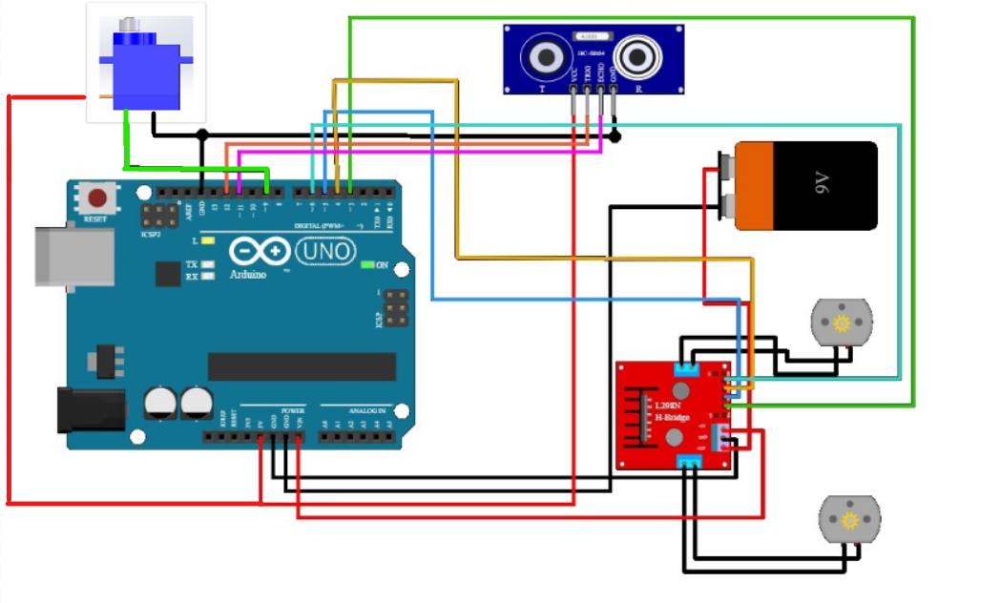

# Obstacle Avoiding Robot Documentation

## Table of Contents
1. [Introduction](Introduction)
2. [Hardware Components](#hardware-components)
   - [Arduino Uno](#arduino-uno)
   - [Servo Motor](#servo-motor)
   - [Ultrasonic Sensor](#ultrasonic-sensor)
   - [Gear Motor](#gear-motor)
   - [Caster Wheel](#caster-wheel)
   - [L298 Motor Driver](#l298-motor-driver)
3. [Software Requirements](#software-requirements)
4. [Assembly Instructions](#assembly-instructions)
5. [Wiring Diagram](#wiring-diagram)
6. [Arduino Code](#arduino-code)
7. [Operation](#operation)
8. [Troubleshooting](#troubleshooting)
9. [Contributing](#contributing)
10. [License](#license)

## 1. Introduction
This GitHub documentation provides step-by-step instructions on building an obstacle-avoiding robot using an Arduino Uno, servo motor, ultrasonic sensor, gear motor, caster wheel, and L298 motor driver. This robot is designed to navigate autonomously while avoiding obstacles in its path.

## 2. Hardware Components
### 2.1 Arduino Uno
- Arduino is a prototype platform (open-source) based on an easy-to-use hardware and software. It consists of a circuit board, which can be programed (referred to as a microcontroller) and a ready-made software called Arduino IDE (Integrated Development Environment), which is used to write and upload the computer code to the physical board.
[CheckOut Datasheet]()

### 2.2 Servo Motor
- Micro Servo Motor SG90 is a tiny and lightweight server motor with high output power. Servo can rotate approximately 180 degrees (90 in each direction), and works just like the standard kinds but smaller. You can use any servo code, hardware or library to control these servos
[CheckOut Datasheet](http://www.datasheet-pdf.com/PDF/SG90-Datasheet-TowerPro-791970)

### 2.3 Ultrasonic Sensor
- The HC-SR04 Ultrasonic Distance Sensor is a sensor used for detecting the distance to an object using sonar. It's ideal for any robotics projects your have which require you to avoid objects, by detecting how close they are you can steer away from them!
[CheckOut Datasheet](https://www.alldatasheet.com/datasheet-pdf/pdf/1132204/ETC2/HCSR04.html)

### 2.4 Gear Motor
- It is a BO Series 1 100RPM DC Motor Plastic Gear Motor. The BO series straight motor gives good torque and rpm at lower operating voltages, which is the biggest advantage of these motors.
[CheckOut Datasheet](https://media.digikey.com/pdf/Data%20Sheets/Adafruit%20PDFs/3777_Web.pdf)

### 2.5 Caster Wheel
- A caster (also castor according to some dictionaries) is a wheeled device typically mounted to a larger object that enables relatively easy rolling movement of the object

### 2.6 L298 Motor Driver
- The L298 is an integrated monolithic circuit in a 15-lead Multiwatt and PowerSO20 packages. It is a high voltage, high current dual full-bridge driver designed to accept standard TTL logic levels and drive inductive loads such as relays, solenoids, DC and stepping motors.
[CheckOut Datasheet](https://www.sparkfun.com/datasheets/Robotics/L298_H_Bridge.pdf)

## 3. Software Requirements
- The Arduino IDE is an open-source software, which is used to write and upload code to the Arduino boards.
[Arduino IDE](https://www.arduino.cc/en/software)

## 5. Wiring Diagram
- 

## 6. Arduino Code

[Obstacle_Avoiding_Robo.ino](obstacle_avdng/obstacle_avdng.ino)
